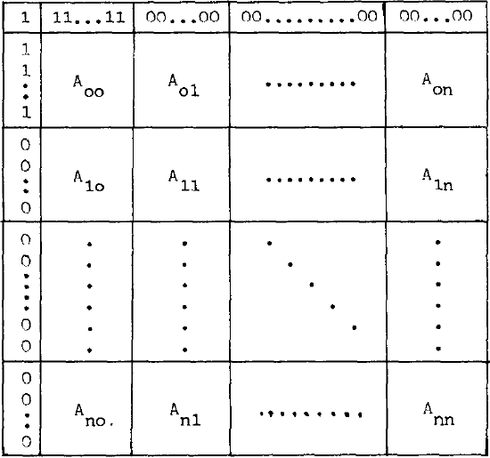
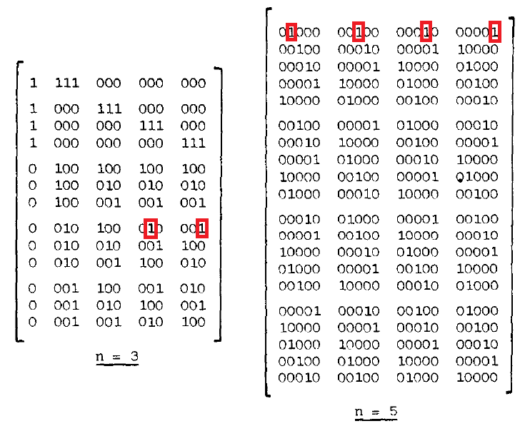

# Pair It Up

This is a project that uses FPE (finite projective planes) to generate cards with symbols, ensuring each pair of cards has exactly one symbol in common.
It is achieved using two methods. First one generates Desarguesian projective planes for odd orders of planes. The second one uses ordered form to generate projective planes for plane orders that are a power of 2.
The placement of symbols on the cards is used by a way of force directed graphs with slight modifications.

There is an `angular-main` branch that has a project of an app using the generated data to create an online game of matching the symbols on the cards. The rest of the document will go in more detail as to the way the generation works.

## Symbol distribution

First matter is distributing symbols between the cards. After analysing `Bernard Montaron, "On Incidence Matrices Of Finite Projective Planes", Renix Electronique, BP 1146, 31036 Toulouse, Ceder, France, 1984` the following distribution system was assumed.

Depicted matrix is an incidence matrix between points and lines on FPE. 1s in the matrix represent that a line and a point are incident, or in our case, a symbol is contained within a card. Since FPEs require every two lines can only have one point in common and every two points can only have one line in common, there is a certain freedom in choosing if symbols on a card are represented by a row or a column. 
The ordered form of a matrix is possible, because assuming existence of a valid FPE, it doesn't matter which way we index lines or points as long as we stay consistent, so we can freely swap rows and columns. 
One thing to mention that is not a part of this paper is that the order *n* of the plane needs to be a prime power. While the existence of FPE with orders which are not a power of a prime number is not proven to be impossible, none of the generation methods work for such cases.

As for Aij, they are square submatrices of dimension *n+1*, where *n* is the order of the FPE. Value of *n* also happens to be one less than a number of symbols we want on a single card. The total number of cards (or symbols) achieved that way is equal to *n2+n+1*, which we can take a subset of freely. 
The paper assumed that all submatrices with 1 as either row or column index that don't have 0 as an other index are identity matrices. Submatrices with 0 as one of the indices take the other index to fill the corresponding row or column with 1s, meaning A00 is a matrix filled with 0s.

The paper then suggested there are only *n-2* other submatrices, distributed in the rest of the matrix in the form of a **latin square**. For even order *n*, that is also a power of 2, the way to generate submatrices is given, by the use of submatrices of a smaller even order. 
For odd order of *n* the way to generate submatrices is not given. While I had trouble understanding the paper, I was under the impression that it implied a form of A2j has a first 1 placed in *j* column of submatrix, indexing from one. The following rows of the submatrix had their 1s in a circular shift of one compared to the previous row. The following picture shows the first one being placed in a matrix of odd order. Only submatrix for *n=5* is shown to reduce space taken.

With the paper speaking of symmetrical and assymetrical forms, I tried to make certain assumptions as to the latin squares that could potentially speed up the generation of the plane. When they didn't work for order of 8 or 9, I tried to remove those assumptions and look for the way of generating latin squares. After finding `Marcel J.G. Gorissen," Generating Finite Projective Planes from Non-Paratopic Latin Squares", January 2007` I tried to implement **Backtracking Algorithm** to search for valid squares, made in C++. 
Unfortunately, while it worked for order 8, I found that the assumption about how the matrix must be built is not right, at least for order 9. I tried to fill the whole matrix with 1s using the backtracking algorithm, ignoring latin squares and the like. Alas, building the matrix was too time consuming, with order of 7 takin up over 20 minutes to compute correct matrix. So another way to generate odd order incidence matrix had to be found.

Luckily, I stumbled upon `Jessica Bariffi, "A Finite Geometry Construction for MDPC-Codes", April 28, 2020`, which by the title alone does not imply the commonallity of problems. However the way MDPC codes are generated uses projective planes, focusing on orders where *n* is an odd. 
The paper deals with projective bundles using instructions given by ***Hirschfeld***. They allow to receive **perfect difference set**, which gives us indices of points of a line and which can be used to generate indices of points on other lines by simply circularly shifting indices by one, until we receive the same set of indices as we started with. The perfect difference set ensures there are no more or no less than a single point in common between two lines. 
The paper also gives *Sage* script needed for generating given perfect difference set. It is using *Conway polynolmals* under the hood, which are expensive to compute. That means I've decided against adapting it to C++ code in a way allowing to generate infinite differece sets. Saved data allowed me to generate the needed distribution for 91 symbols/cards, which I already set as an upper limit of the project.

## Placing symbols on a card

Now to the issue of placing symbols on a card. First, it is assumed that the same symbol can have different sizes between different card instances. Assuming size of a card being 100px (with possibility to scale up), we find that 15px is a minimum size that gives a readable symbol. As for a maximum size, I used information distributed in `Kravitz, Sidney. “Packing Cylinders into Cylindrical Containers.” Mathematics Magazine 40, no. 2 (1967)` which gives following formula:
$$\frac{R}{r} = \frac{2}{1-\tan^2{(\frac{\pi}{4} - \frac{\pi}{2N})}}$$
Where *R* is an outer radius of a ring, *r* is a radius of each equal cylinder placed inside and *N* is a number of cylinders. Since the given radius is an extreme case when the card would be fully packed and we want to have a buffer between symbols, the maximum symbol size is reduced by a marginal value of 2.

Next we consider the placement of the cards. We do it with the use of *Fruchterman* and *Reingold*'s method, simulating electric and gravitational forces whilst using simulated annealing, in accordance to `Stephen G. Kobourov, "Spring Embedders and Force Directed Graph Drawing Algorithms", Ch. 12. Force-Directed Drawing Algorithms, January 2012`. The algorithm is used for vertices over large area and doesn't consider their sizes, meaning end result has overlapping symbols.

To account for that, we try to apply greater forces when the symbols are overlapping, whilst blocking the symbols from leaving the bounds of a card. Noticing that is not enough to prevent symbols from overlapping, I added unravelling algorithm, which searches for the closest unoccupied area that can fit a symbol, moving in a spiral to better find space in area of a circle representing a card. Finally, the positions of the symbols, along with their random rotations, are placed inside a *.json* file to save for the further use.